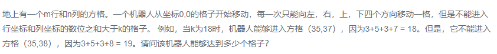

### 题目要求



### 解题思路

回溯法通吃，思路和 [offer12 矩阵路径类似](offer12.md)，直接手撸即可。

### 本题代码

```c++
class Solution {
public:
    int movingCount(int threshold, int rows, int cols)
    {
        bool* flag = new bool[rows * cols];
        for(int i = 0;i < rows * cols;i++){
            flag[i] = false;
        }
        int count = moving(threshold, rows, cols, 0, 0, flag);
        return count;
    }
    int moving(int threshold, int rows, int cols, int i, int j, bool* flag){
        int count = 0;
        if(i >= 0 && i < rows && j >= 0 && j < cols && getsum(i) + getsum(j) <= threshold && flag[i * cols + j] == false){
            flag[i * cols + j] = true;
            count = 1 + moving(threshold, rows, cols, i+1, j, flag) + moving(threshold, rows, cols, i-1, j, flag)
                + moving(threshold, rows, cols, i, j + 1, flag) 
                + moving(threshold, rows, cols, i, j-1, flag);
        }
        return count;
    }
    int getsum(int num){
        int sum = 0;
        while(num){
            sum += num % 10;
            num /= 10;
        }
        return sum;
    }
};
```

### [手撸测试](<https://www.nowcoder.com/practice/6e5207314b5241fb83f2329e89fdecc8?tpId=13&tqId=11219&tPage=4&rp=1&ru=%2Fta%2Fcoding-interviews&qru=%2Fta%2Fcoding-interviews%2Fquestion-ranking>) 
