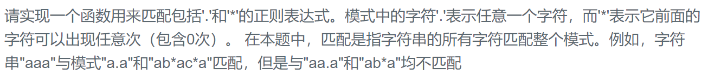

### 题目要求



### 解题思路

核心点在于`p[1]`是否是`'*'`，如果`p[1] != '*'`那就看`s`和`p`的第一个是否相同(还有一种情况`s`不空，`p`第一个为`'.'`)要满足的话就看`s`和`p`下一个匹配了，如果不满足直接返回`false`。如果`p[1] == '*'`，还是前面的情况，`s`和`p`的第一个是否相同(或者`s`不空，`p`第一个为`'.'`)，要满足的话可以选择`p`匹配多少次，如果是0次，那`s`不动，`p`往后跳两个；如果是1次或者多次，那么`s`往后跳1个，`p`不动。如果不满足，那么只能匹配0次也就是`s`不动，`p`往后跳两个。

### 本题代码

```c++
class Solution {
public:
    bool match(char* str, char* pattern)
    {
        if(*str == '\0' && *pattern == '\0')
            return true;
        if(*str != '\0' &&  *pattern == '\0')
            return false;
        if(*(pattern + 1) != '*'){
            if(*str == *pattern || (*str != '\0' && *pattern == '.'))
                return match(str + 1, pattern + 1);
            else
                return false;
        }
        else{
            if (*str == *pattern || (*str != '\0' && *pattern == '.'))
                return match(str, pattern+2) || match(str+1, pattern);
            else
                return match(str, pattern+2);
        }
    }
};
```

### [手撸测试](https://www.nowcoder.com/practice/45327ae22b7b413ea21df13ee7d6429c?tpId=13&tqId=11205&tPage=1&rp=1&ru=/ta/coding-interviews&qru=/ta/coding-interviews/question-ranking)  

