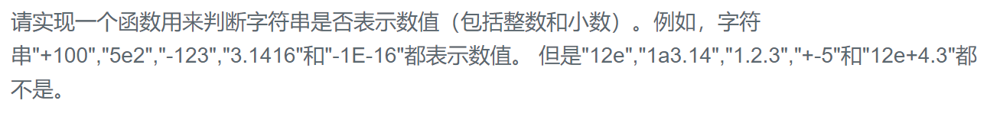

### 题目要求



### 解题思路

判断字符串是不是可以用十进制表示，使用直接法遍历看是否能够到达字符串的尾部。特殊的字符有`" "`(空格)、`"+"`、`"-"`、`"e"`、`"E"`、`"."`。字符串左右的空格首先去掉，中间出现空格即为非法；`"e"`、`"E"`重复出现以及后面不跟数字为非法；多符号的情况下，前一个不为`"e"`、`"E"`非法，单符号下前一个字符为`"e"`或`"E"`非法；字符不满足`"0"~"9"`非法。

### 本题代码

```c++
class Solution {
public:
    bool isNumber(string s) {
        if(s.size() == 0)
            return false;
        int i = 0;
        while(i < s.size() && s[i] == ' ')
            i++;
        if(i < s.size() && (s[i] == '-' || s[i] == '+'))
            i++;
        int nd = 0, np = 0;
        while(i < s.size()){
            if(s[i] == '.')
                np++;
            else if(s[i] - '0' >= 0 && s[i] - '0' <= 9)
                nd++;
            else
                break;
            i++;
        }
        if(nd == 0 || np > 1)
            return false;
        if(s[i] == 'e'){
            i++;
            nd = 0;
            if(i < s.size() && (s[i] == '-' || s[i] == '+'))
                i++;
            while(i < s.size() && (s[i] - '0' >= 0 && s[i] - '0' <= 9)){
                i++;
                nd++;
            }
            if(nd == 0)
                return false;
        }
        while(s[i] == ' ')
            i++;
        return i == s.size();
    }
};
```

### [手撸测试](https://www.nowcoder.com/practice/6f8c901d091949a5837e24bb82a731f2?tpId=13&tqId=11206&tPage=3&rp=1&ru=%2Fta%2Fcoding-interviews&qru=%2Fta%2Fcoding-interviews%2Fquestion-ranking)  

