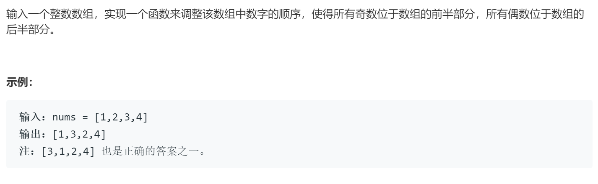

### 题目要求



### 解题思路

双指针以及辅助栈都可以解决。

### 本题代码

```c++
class Solution {
public:
    vector<int> exchange(vector<int>& nums) {
        if(nums.size() == 0)
            return nums;
        int start = 0, end = nums.size() - 1;
        while(start < end){
            while((start < end) && (nums[start] % 2 != 0))
                start++;
            while((start < end) && (nums[end] % 2 == 0))
                end--;
            if(start < end){
                int temp = nums[start];
                nums[start] = nums[end];
                nums[end] = temp;
            }
        } 
        return nums;
    }
};
```

### [手撸测试](https://leetcode-cn.com/problems/diao-zheng-shu-zu-shun-xu-shi-qi-shu-wei-yu-ou-shu-qian-mian-lcof/)  

