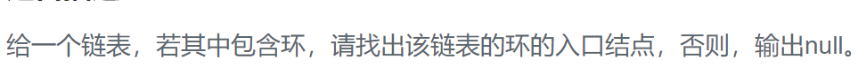

### 题目要求



### 解题思路

参考代码[环形链表I](141.md) 和[环形链表II](142.md) 

### 本题代码

```c++
class Solution {
public:
    bool hasCycle(ListNode *head) {
        ListNode* slow = head;
        ListNode* fast = head;
        while(fast != NULL){
            slow = slow->next;
            fast = fast->next;
            if(fast == NULL)
                return false;
            fast = fast->next;
            if(fast && slow == fast)
                return true;
        }
        return false;
    }
};
```

### [手撸测试](https://nlper.gitbook.io/leetcode/141)  

