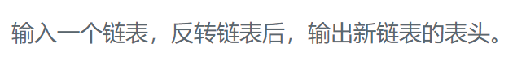

### 题目要求



### 解题思路

直接法。

### 本题代码

```c++
class Solution {
public:
    ListNode* ReverseList(ListNode* pHead) {
        if(pHead == NULL || pHead->next == NULL)
            return pHead;
        ListNode* pre = NULL;
        while(pHead){
            ListNode* next = pHead->next;
            pHead->next = pre;
            pre = pHead;
            pHead = next;
        }
        return pre;
    }
};
```

### [手撸测试](https://www.nowcoder.com/practice/75e878df47f24fdc9dc3e400ec6058ca?tpId=13&tqId=11168&tPage=1&rp=1&ru=/ta/coding-interviews&qru=/ta/coding-interviews/question-ranking)  

