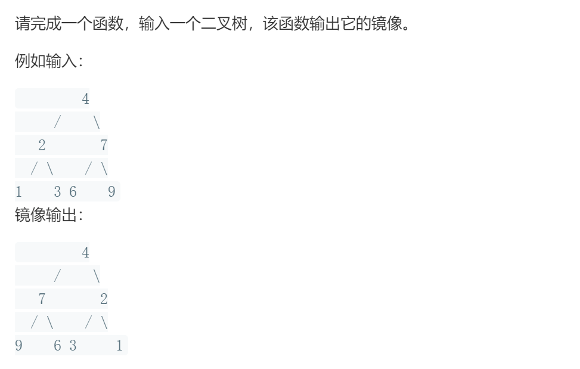

### 题目要求



### 解题思路

先保存左右树节点，左右树互换，递归解决。

### 本题代码

```c++
class Solution {
public:
    TreeNode* mirrorTree(TreeNode* root) {
        if(!root)
            return root;
        TreeNode* left = root->left;
        TreeNode* right = root->right;
        root->left = mirrorTree(right);
        root->right = mirrorTree(left);
        return root;
    }
};
```

### [手撸测试](https://leetcode-cn.com/problems/er-cha-shu-de-jing-xiang-lcof/)  

