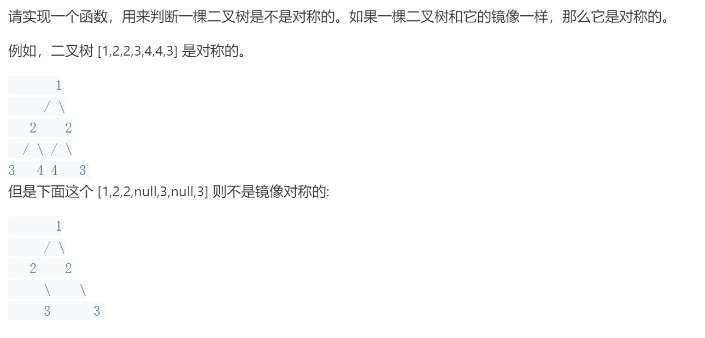

### 题目要求



### 解题思路

构建两树，递归判断。

### 本题代码

```c++
class Solution {
public:
    bool isSymmetric(TreeNode* root) {
        if(!root)
            return true;
        return helper(root->left, root->right);
    }
    bool helper(TreeNode* root1, TreeNode* root2){
        if(!root1)
            return root2 == NULL;
        if(!root2)
            return root1 == NULL;
        if(root1->val != root2->val)
            return false;
        return helper(root1->left, root2->right) && helper(root1->right, root2->left);
    }
};
```

### [手撸测试](https://leetcode-cn.com/problems/dui-cheng-de-er-cha-shu-lcof/)  

