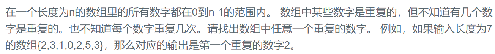

### 题目要求



### 解题思路

### 本题代码

```c++
class Solution {
public:
    int findRepeatNumber(vector<int>& nums) {
        for(int i = 0;i < nums.size();i++){
            while(nums[i] != i && nums[i] != nums[nums[i]]){
                int temp = nums[i];
                nums[i] = nums[temp];
                nums[temp] = temp;
            }
        }
        for(int i = 0;i < nums.size();i++)
            if(nums[i] != i)
                return nums[i];
        return -1;
    }
};
```

### [手撸测试](https://www.nowcoder.com/practice/623a5ac0ea5b4e5f95552655361ae0a8?tpId=13&tqId=11203&tPage=1&rp=1&ru=/ta/coding-interviews&qru=/ta/coding-interviews/question-ranking)   

