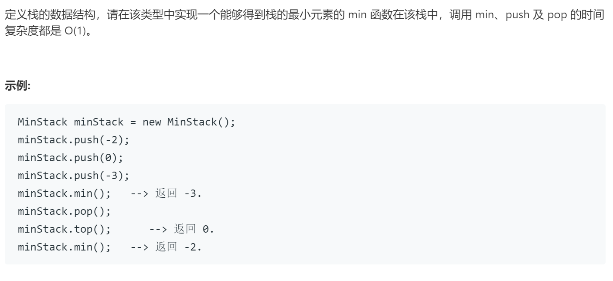

### 题目要求



### 解题思路

两个辅助栈来解决问题。

### 本题代码

```c++
class MinStack {
public:
    /** initialize your data structure here. */
    MinStack() {
        
    }
    
    void push(int x) {
        if(s2.empty()){
            s2.push(x);
        }
        else if(s2.top() < x){
            s2.push(s2.top());
        }
        else{
            s2.push(x);
        }
        s1.push(x);
    }
    
    void pop() {
        if(s1.empty())
            return;
        s1.pop();
        s2.pop();
    }
    
    int top() {
        return s1.top();
    }
    
    int min() {
        return s2.top();
    }
    private:
    stack<int>s1;
    stack<int>s2;
};

/**
 * Your MinStack object will be instantiated and called as such:
 * MinStack* obj = new MinStack();
 * obj->push(x);
 * obj->pop();
 * int param_3 = obj->top();
 * int param_4 = obj->min();
 */
```

### [手撸测试](https://leetcode-cn.com/problems/bao-han-minhan-shu-de-zhan-lcof/)  

