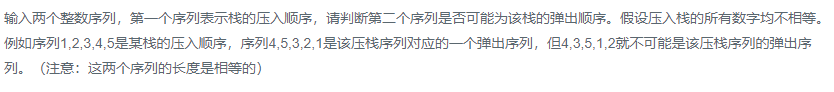

### 题目要求



### 解题思路

将压入顺序数组用栈模拟，将弹出顺序数组用队列模拟。当栈顶和队列头元素相等时，两个容器都弹出，直到栈为空说明两者顺序对应。

### 本题代码

```c++
class Solution {
public:
    bool IsPopOrder(vector<int> pushV,vector<int> popV) {
        if(pushV.size() == 0 || popV.size() == 0 || pushV.size() != popV.size()){
            return false;
        }
        queue<int>order;
        stack<int>s;
        for(int i = 0;i < popV.size();i++){
            order.push(popV[i]);
        }
        for(int i = 0;i < pushV.size();i++){
            s.push(pushV[i]);
            while(!s.empty() && s.top() == order.front()){
                s.pop();
                order.pop();
            }
        }
        if(!s.empty()){
            return false;
        }
        return true;
    }
};
```

### [手撸测试](<https://www.nowcoder.com/practice/d77d11405cc7470d82554cb392585106?tpId=13&tqId=11174&tPage=2&rp=1&ru=%2Fta%2Fcoding-interviews&qru=%2Fta%2Fcoding-interviews%2Fquestion-ranking>) 

