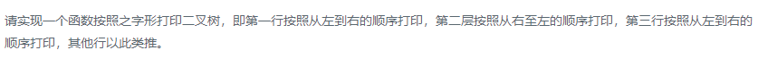

### 题目要求



### 解题思路

#### 之字形打印

利用两个栈，广度优先遍历交替压栈出栈。

#### 按行输出

一个size解决

### 本题代码

#### 之字形打印

```c++
class Solution {
public:
    vector<vector<int> > Print(TreeNode* pRoot) {
        if(!pRoot)
            return vector<vector<int>>();
        stack<TreeNode*>s1;
        stack<TreeNode*>s2;
        vector<vector<int>>res;
        s1.push(pRoot);
        while(!s1.empty() || !s2.empty()){
            if(!s1.empty()){
                vector<int>data;
                while(!s1.empty()){
                    data.push_back(s1.top()->val);
                    if(s1.top()->left)
                        s2.push(s1.top()->left);
                    if(s1.top()->right)
                        s2.push(s1.top()->right);
                    s1.pop();
                }
                res.push_back(data);
            }
            else{
                vector<int>data;
                while(!s2.empty()){
                    data.push_back(s2.top()->val);
                    if(s2.top()->right)
                        s1.push(s2.top()->right);
                    if(s2.top()->left)
                        s1.push(s2.top()->left);
                    s2.pop();
                }
                res.push_back(data);
            }
        }
        return res;
    }
};
```

#### 按行输出

```c++
class Solution {
public:
    vector<vector<int>> levelOrder(TreeNode* root) {
        if(!root)
            return vector<vector<int>>();
        queue<TreeNode*>q;
        q.push(root);
        vector<vector<int>>res;
        while(!q.empty()){
            int size = q.size();
            vector<int>data;
            for(int i = 0;i < size;i++){
                TreeNode* node = q.front();
                q.pop();
                data.push_back(node->val);
                if(node->left)
                    q.push(node->left);
                if(node->right)
                    q.push(node->right);
            }
            res.push_back(data);
        }
        return res;
    }
};
```

### [手撸测试](https://leetcode-cn.com/problems/cong-shang-dao-xia-da-yin-er-cha-shu-iii-lcof/)  

