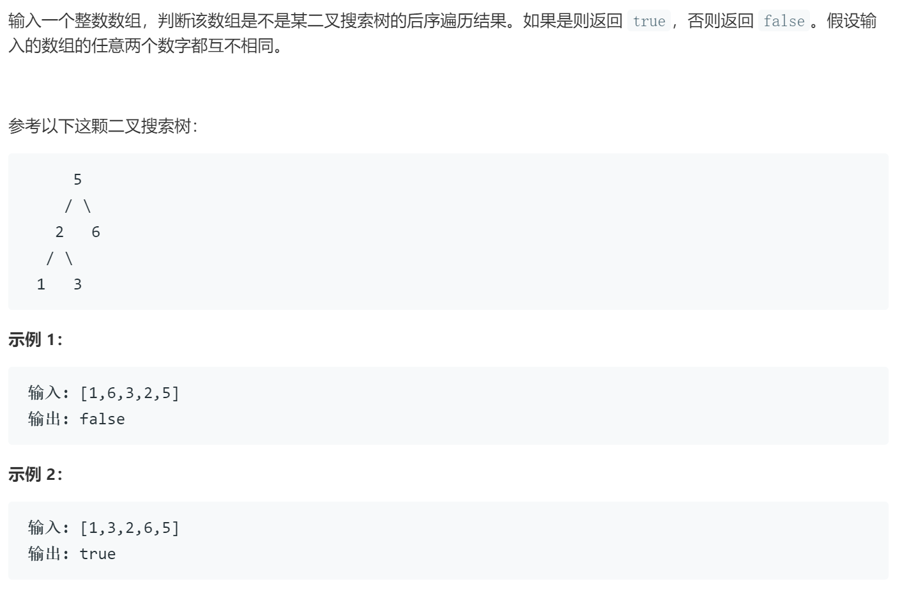

### 题目要求



### 解题思路

二叉树的后序遍历，说明最后一个元素是头节点，就可以用左右指针界定左右树，并且小于该节点的值都是左数，分好左右树之后，如果右树中有小于该节点的就直接返回`false`。

### 本题代码

```c++
class Solution {
public:
    bool verifyPostorder(vector<int>& postorder) {
        if(postorder.size() == 0)
            return true;
        return helper(postorder, 0, postorder.size() - 1);
    }
    bool helper(vector<int>& postorder, int begin, int end){
        if(begin > end)
            return false;
        int root = postorder[end];
        int i = begin;
        for(;i < end;i++){
            if(postorder[i] > root)
                break;
        }
        for(int j = i;j < end;j++)
            if(postorder[j] < root)
                return false;
        bool left = true, right = true;
        if(i > begin)
            left = helper(postorder, begin, i-1);
        if(i < end-1)
            right = helper(postorder, i, end-1);
        return left && right;
    }
};
```

### [手撸测试](https://leetcode-cn.com/problems/er-cha-sou-suo-shu-de-hou-xu-bian-li-xu-lie-lcof/)  

