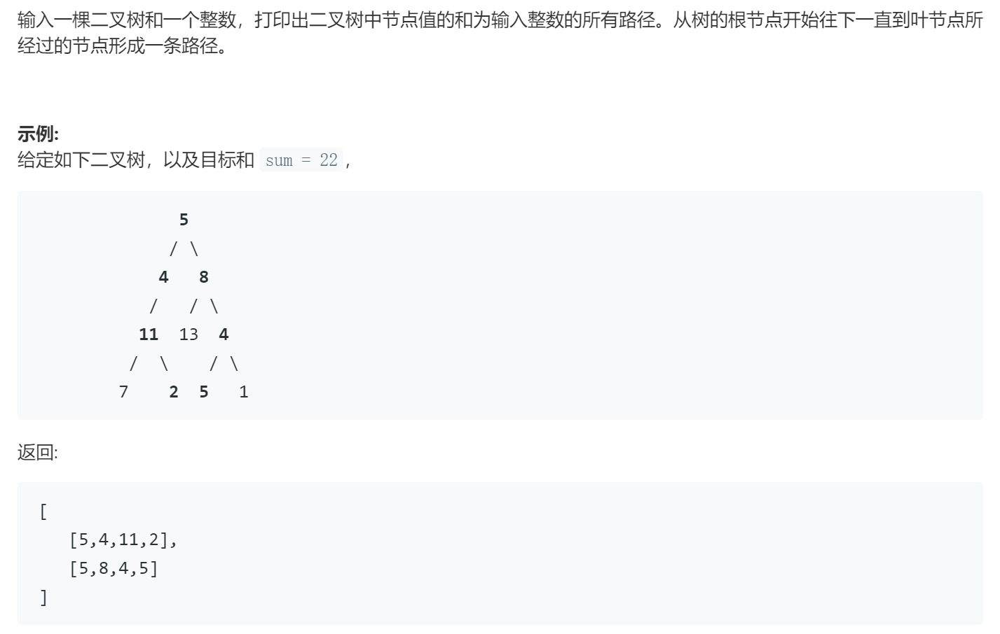

### 题目要求



### 解题思路

dfs直接手撸，注意到叶子节点为止。

### 本题代码

```c++
class Solution {
public:
    vector<vector<int>> pathSum(TreeNode* root, int sum) {
        if(!root)
            return vector<vector<int>>();
        vector<vector<int>>res;
        vector<int>path;
        dfs(root, sum, path, res);
        return res;
    }
    void dfs(TreeNode* root, int sum, vector<int>& path, vector<vector<int>>& res){
        if(!root)
            return;
        sum -= root->val;
        path.push_back(root->val);
        if(sum == 0 && root->right == NULL && root->left == NULL){
            res.push_back(path);
        }
        dfs(root->left, sum, path, res);
        dfs(root->right, sum, path, res);
        path.pop_back();
        sum += root->val;
    }
};
```

### [手撸测试](https://leetcode-cn.com/problems/er-cha-shu-zhong-he-wei-mou-yi-zhi-de-lu-jing-lcof/)  

