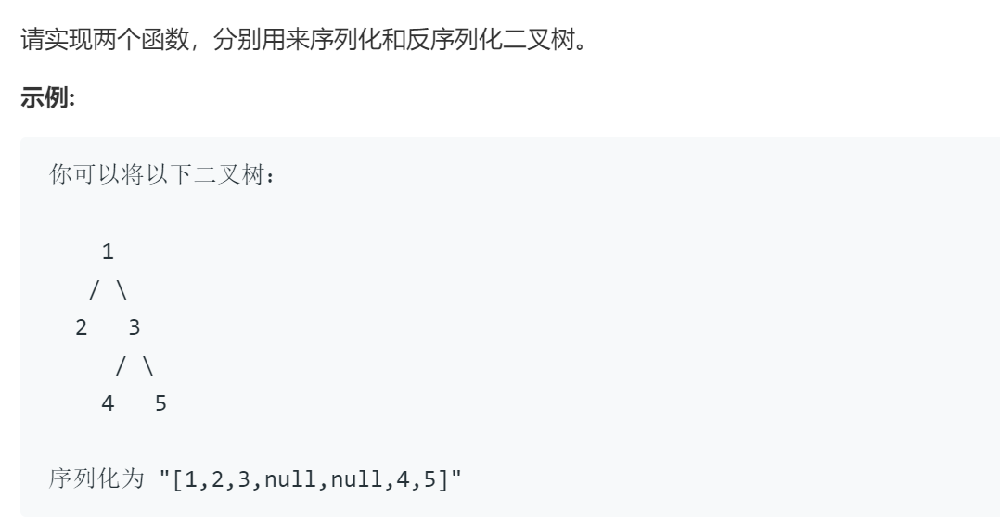

### 题目要求



### 解题思路

序列化：采用`BFS`，遇到`NULL`使用`'#'`代替；遇到`val`使用`to_string`转换成`string`，后面加`'!'`结尾。

反序列化：采用`BFS`，利用两个指针`i`、`j`遍历。

### 本题代码

```c++
class Codec {
public:

    // Encodes a tree to a single string.
    string serialize(TreeNode* root) {
        if(root == NULL)
            return string();
        string res;
        queue<TreeNode*>q;
        q.push(root);
        while(!q.empty()){
            int count = q.size();
            while(count--){
                TreeNode* node = q.front();
                q.pop();
                if(node == NULL)
                    res += '#';
                else{
                    res += to_string(node->val) + '!';
                    q.push(node->left);
                    q.push(node->right);
                }
            }
        }
        return res;
    }

    // Decodes your encoded data to tree.
    TreeNode* deserialize(string data) {
        if(data.size() == 0)
            return NULL;
        int i = 0, j = 0;
        while(j < data.size() && data[j] != '!')
            j++;
        TreeNode* root = new TreeNode(stoi(data.substr(i, j-i)));
        queue<TreeNode*>q;
        q.push(root);
        while(!q.empty()){
            TreeNode* node = q.front();
            q.pop();
            if(node == NULL)
                continue;
            i = ++j;
            if(i >= data.size())
                break;
            if(data[i] == '#')
                node->left = NULL;
            else{
                while(j < data.size() && data[++j] != '!');
                node->left = new TreeNode(stoi(data.substr(i, j-i)));
            }
            q.push(node->left);
            i = ++j;
            if(i >= data.size())
                break;
            if(data[i] == '#')
                node->right = NULL;
            else{
                while(j < data.size() && data[++j] != '!');
                node->right = new TreeNode(stoi(data.substr(i, j-i)));
            }
            q.push(node->right);
        }
        return root;
    }
};

```

### [手撸测试](https://leetcode-cn.com/problems/xu-lie-hua-er-cha-shu-lcof/)  

