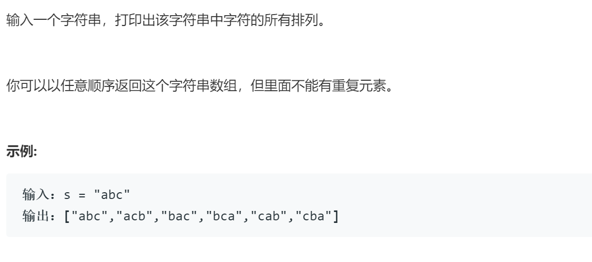

### 题目要求



### 解题思路

很简单的基础题，但是需要注意输入中相同的字母需要使用`is_ok`函数判断。

### 本题代码

```c++
class Solution {
public:
    vector<string> permutation(string s) {
        if(s.size() == 0)
            return vector<string>();
        vector<string>res;
        perm(s, 0, res);
        return res;
    }
    void perm(string& s, int begin, vector<string>& res){
        if(begin >= s.size()){
            res.push_back(s);
            return;
        }
        for(int i = begin;i < s.size();i++){
            if(is_ok(s, begin , i)){
                swap(s, begin, i);
                perm(s, begin + 1, res);
                swap(s, begin, i);
            }
        }
    }
    bool is_ok(string& s, int begin, int i){
        if(begin < i){
            for(int j = begin;j < i;j++){
                if(s[j] == s[i])
                    return false;
            }
        }
        return true;
    }
    void swap(string& s, int i, int j){
        int temp = s[i];
        s[i] = s[j];
        s[j] = temp;
    }
};
```

### [手撸测试](https://leetcode-cn.com/problems/zi-fu-chuan-de-pai-lie-lcof/)  

