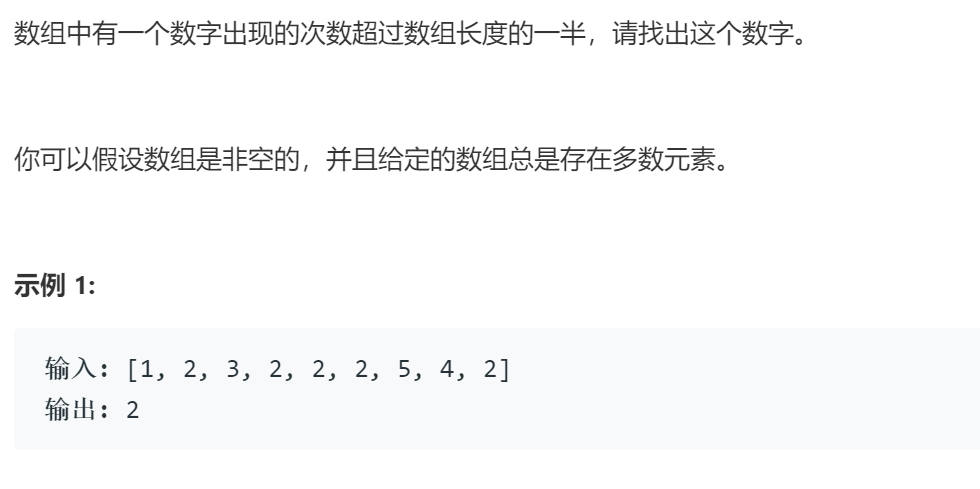

### 题目要求



### 解题思路

摩尔投票；哈希计数。此题有扩展提

### 本题代码

```c++
class Solution {
public:
    int majorityElement(vector<int>& nums) {
        if(nums.size() == 0)
            return -1;
        int time = 1;
        int condidate = nums[0];
        for(int i = 1;i < nums.size();i++){
            if(time == 0){
                condidate = nums[i];
                time++;
            }
            else if(condidate == nums[i]){
                time++;
            }
            else{
                time--;
            }
        }
        time = 0;
        for(auto it : nums){
            if(it == condidate)
                time++;
        }
        return time > nums.size() / 2 ? condidate : -1;

    }
};
```

### [手撸测试](https://leetcode-cn.com/problems/shu-zu-zhong-chu-xian-ci-shu-chao-guo-yi-ban-de-shu-zi-lcof/)  

