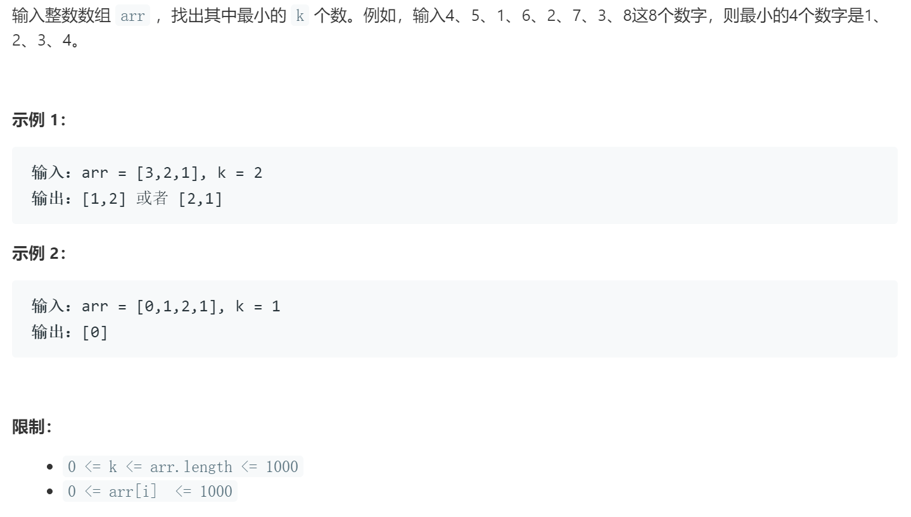

### 题目要求



### 解题思路

巧妙使用优先级队列。

### 本题代码

```c++
class Solution {
public:
    vector<int> getLeastNumbers(vector<int>& arr, int k) {
        if(arr.size() == 0 || k <= 0 || arr.size() < k)
            return vector<int>();
        priority_queue<int, vector<int>, less<int>>q;
        for(int i = 0;i < arr.size();i++){
            if(q.size() != k){
                q.push(arr[i]);
            }
            else{
                if(arr[i] < q.top()){
                    q.pop();
                    q.push(arr[i]);
                }
            }
        }
        vector<int>res;
        while(!q.empty()){
            res.push_back(q.top());
            q.pop();
        }
        return res;
    }
};
```

### [手撸测试](https://leetcode-cn.com/problems/zui-xiao-de-kge-shu-lcof/)  
