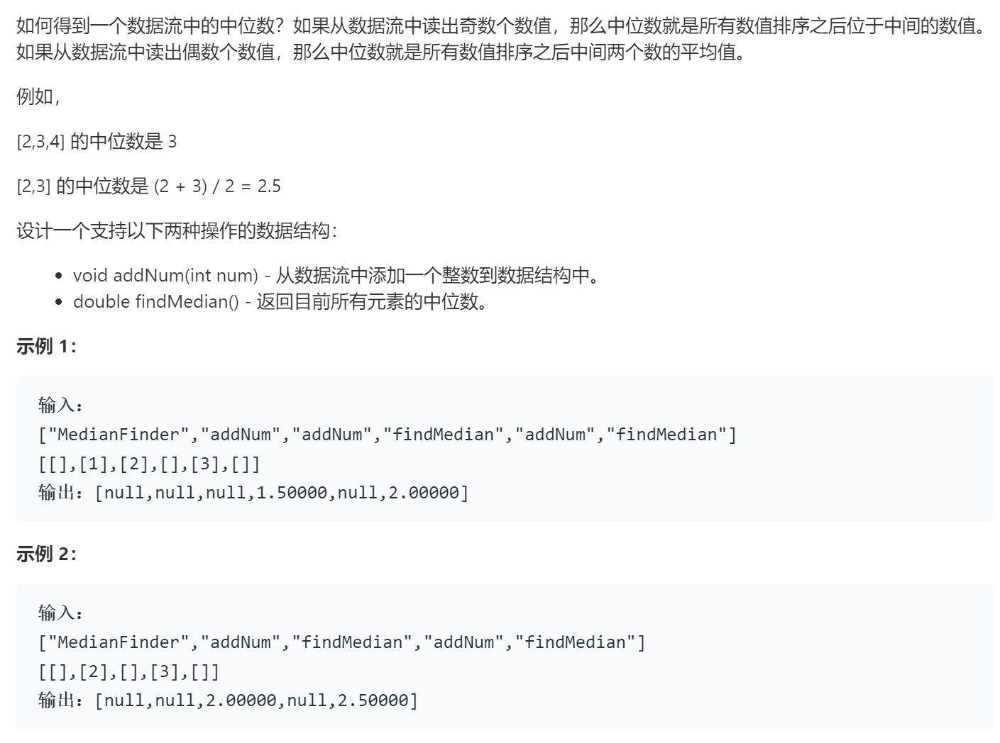

### 题目要求



### 解题思路

两个二叉堆。大根堆保存前一半(或者前一半多一)的数据，小根堆保存后一半的数据，注意`大根堆的数据量大于等于小根堆的数据量`。大根堆堆顶是前半数据中最大的，小根堆堆顶是后半数据中最小的。动态改变两个二叉堆的做法：首先将数插入大根堆，然后将大根堆堆顶插入小根堆中同时大根堆`pop`堆顶，如果大根堆的个数小于小根堆，那么需要将小根堆的堆顶(此时一定是后半数据中最小的)插回大根堆中同时`pop`小根堆堆顶。

### 本题代码

```c++
class MedianFinder {
public:
    /** initialize your data structure here. */
    MedianFinder() {

    }
    
    void addNum(int num) {
        low.push(num);
        heigh.push(low.top());
        low.pop();
        if(low.size() < heigh.size()){
            low.push(heigh.top());
            heigh.pop();
        }
    }
    
    double findMedian() {
        double res = low.size() > heigh.size() ? double(low.top()) : double((low.top() + heigh.top()) * 0.5);
        return res;
    }
    private:
    priority_queue<int, vector<int>, less<int>>low;
    priority_queue<int, vector<int>, greater<int>>heigh;
};
```

### [手撸测试](https://leetcode-cn.com/problems/shu-ju-liu-zhong-de-zhong-wei-shu-lcof/)  

