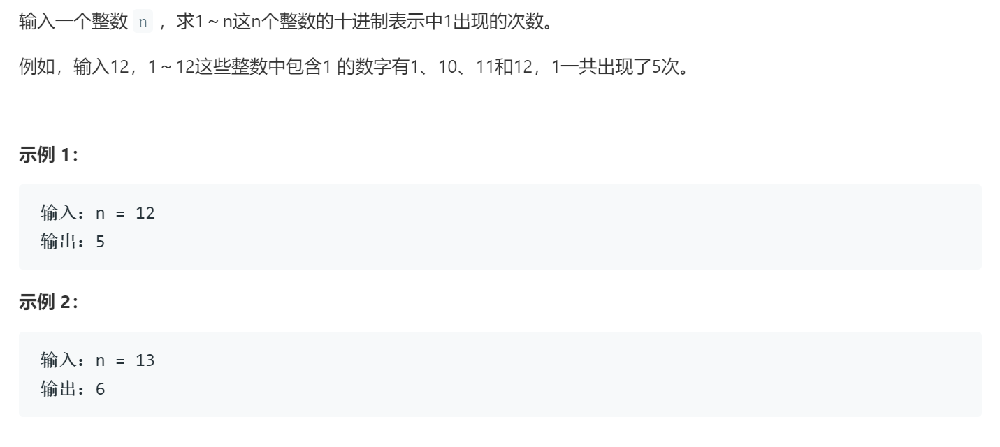
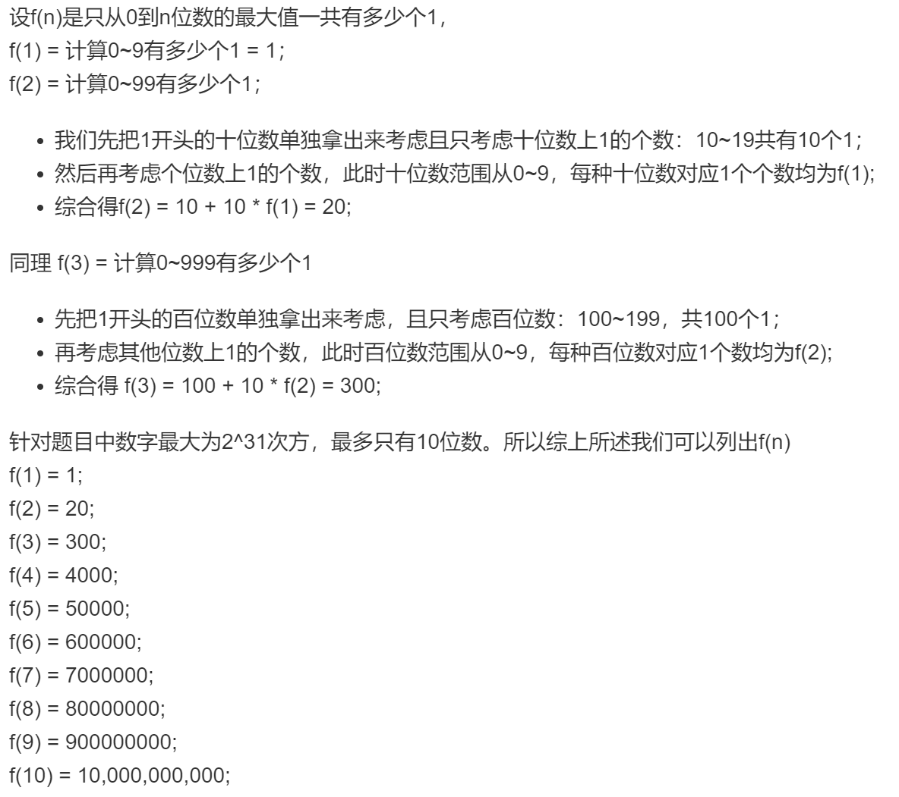
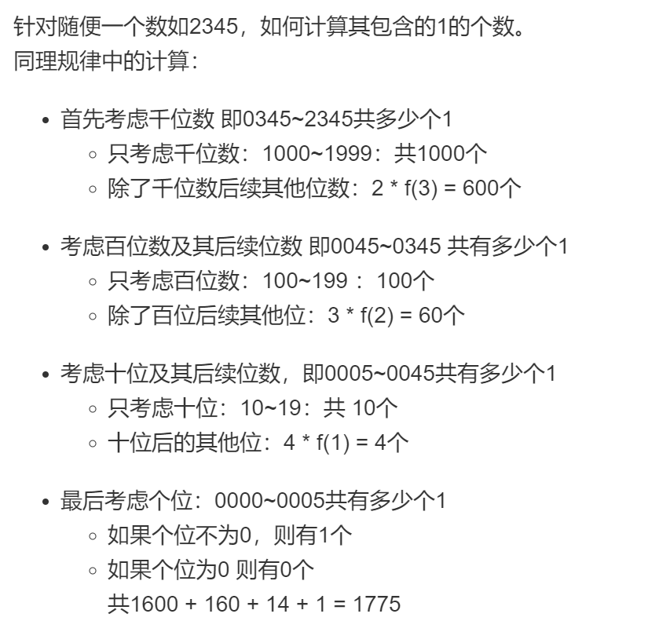
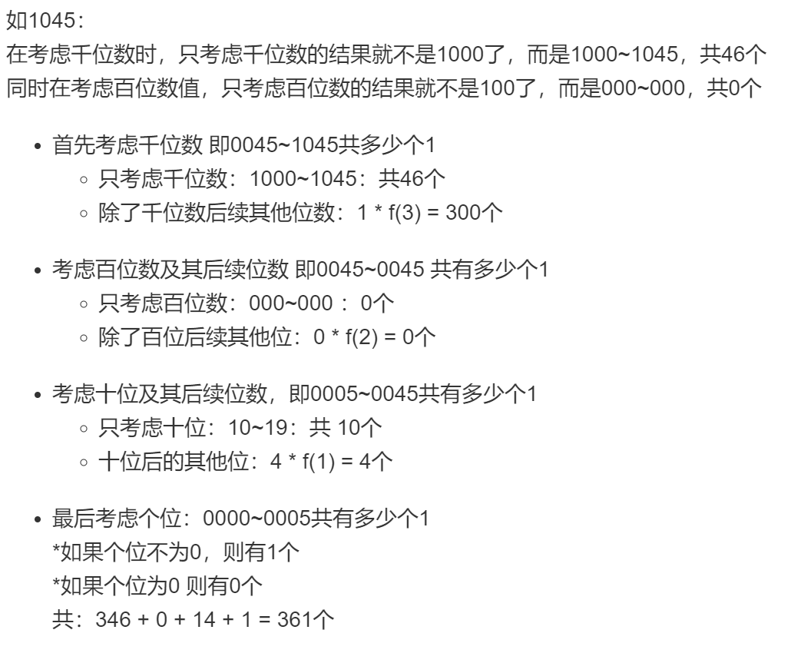

### 题目要求



### 解题思路

两种解法，第一种是爆搜，即从`1~n`统计每一个数字中`1`出现的个数相加；第二种需要巧妙的观察：

举例子如：

但是如果某位出现了位数值小于`1`，那么则：



### 本题代码

```c++
class Solution {
public:
    int countDigitOne(int n) {
        vector<long>help = vector<long>(11);
        help[1] = 1;
        for(int i = 2;i < help.size();i++){
            help[i] = pow(10, i-1) + 10 * help[i-1];
        }
        stack<int> s = stack<int>();
        while(n){
            s.push(n % 10);
            n /= 10;
        }
        long res = 0;
        while(!s.empty()){
            int size = s.size();
            int top = s.top();
            if(size == 1){
                if(top != 0){
                    res += help[1];
                }
            }
            else{
                if(top > 1)
                    res += pow(10, s.size()-1);
                else if(top == 1)
                    res += get_res(s);
                res += top * help[size - 1];
            }
            s.pop();
        }
        return res;
    }
    int get_res(stack<int> s){
        s.pop();
        int res = 0;
        while(!s.empty()){
            res = res * 10 + s.top();
            s.pop();
        }
        return res+1;
    }
};
```

### [手撸测试](https://leetcode-cn.com/problems/1nzheng-shu-zhong-1chu-xian-de-ci-shu-lcof/)  

