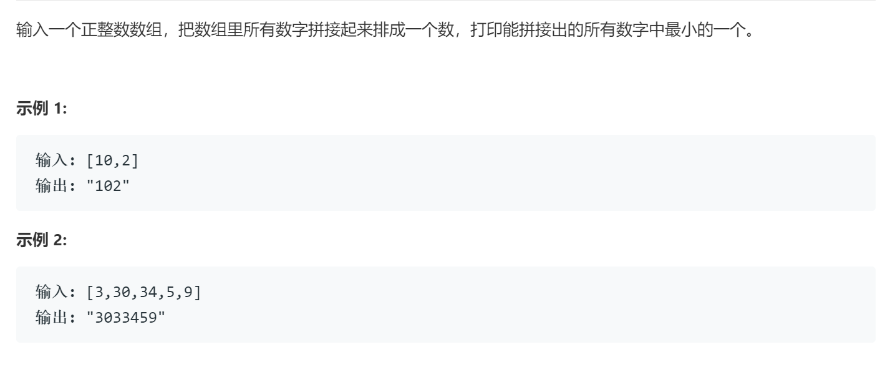

### 题目要求



### 解题思路

使用`sort`函数对数组排序，排序规则是两两字符串组合取最小者。

### 本题代码

```c++
class Solution {
public:
    string minNumber(vector<int>& nums) {
        sort(nums.begin(), nums.end(), compare);
        string res = "";
        for(int i = 0;i < nums.size();i++){
            res += to_string(nums[i]);
        }
        return res;
    }
    static bool compare(int a, int b){
        string str1 = "";
        str1 += to_string(a);
        str1 += to_string(b);
        string str2 = "";
        str2 += to_string(b);
        str2 += to_string(a);
        return str1 < str2;
    }
};
```

### [手撸测试](https://leetcode-cn.com/problems/ba-shu-zu-pai-cheng-zui-xiao-de-shu-lcof/)  

