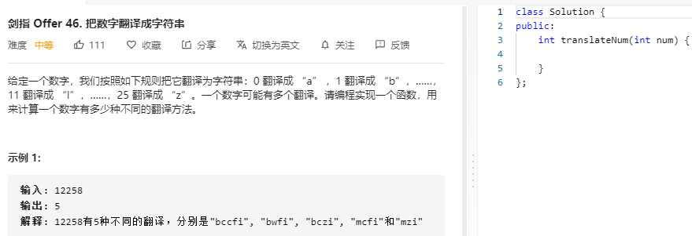

### 题目要求



### 解题思路

动态规划可以解决。观察序列可以得到：

- 如果`i-1`位置是0或者大于2，那么只能翻译`i`位置；
- 如果`i-1`位置等于2但是`i`位置超过5，那也只能翻译`i`位置；
- 除了上述的情况，`i`位置都可以与`i-1`位置的组合翻译。

$$dp[i]$$表示的是第`i`位置为结尾的结果，如果只能使用`i`位置翻译，那么和 $$dp[i-1]$$ 一样，如果可以和`i-1`组合翻译，那么 $$dp[i] = dp[i-2] + dp[i-1].$$ 

### 本题代码

```c++
class Solution {
public:
    bool helper(char a, char b){
        return !(a == '0' || a > '2' || (a == '2' && b > '5'));
    }
    int translateNum(int num) {
        if(num < 0)
            return 0;
        if(num <= 9)
            return 1;
        string nums = to_string(num);
        vector<int>dp(nums.size(), 0);
        dp[0] = 1;
        dp[1] = helper(nums[0], nums[1]) ? 2 : 1;
        for(int i = 2;i < nums.size();i++){
            dp[i] = helper(nums[i-1], nums[i]) ? dp[i-2] + dp[i-1] : dp[i-1];
        }
        return dp[nums.size() - 1];
    }
};
```

### [手撸测试](https://leetcode-cn.com/problems/ba-shu-zi-fan-yi-cheng-zi-fu-chuan-lcof/)  

