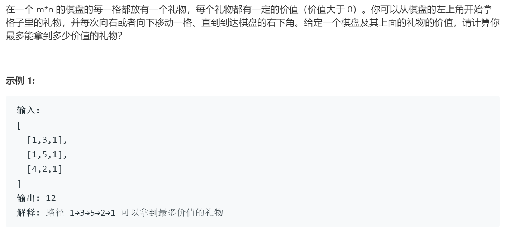

### 题目要求



### 解题思路

基础动态规划，动规方程为：$$grid[i][j] += max(grid[i][j-1], grid[i-1][j])$$。

### 本题代码

```c++
class Solution {
public:
    int maxValue(vector<vector<int>>& grid) {
        if(grid.size() == 0)
            return 0;
        int n = grid.size();
        int m = grid[0].size();
        for(int i = 1;i < grid.size();i++){
            grid[i][0] += grid[i-1][0];
        }
        for(int j = 1;j < grid[0].size();j++){
            grid[0][j] += grid[0][j-1];
        }
        for(int i = 1;i < grid.size();i++){
            for(int j = 1;j < grid[0].size();j++){
                grid[i][j] += max(grid[i-1][j], grid[i][j-1]);
            }
        }
        return grid[n-1][m-1];
    }
};
```

### [手撸测试](https://leetcode-cn.com/problems/li-wu-de-zui-da-jie-zhi-lcof/)  

