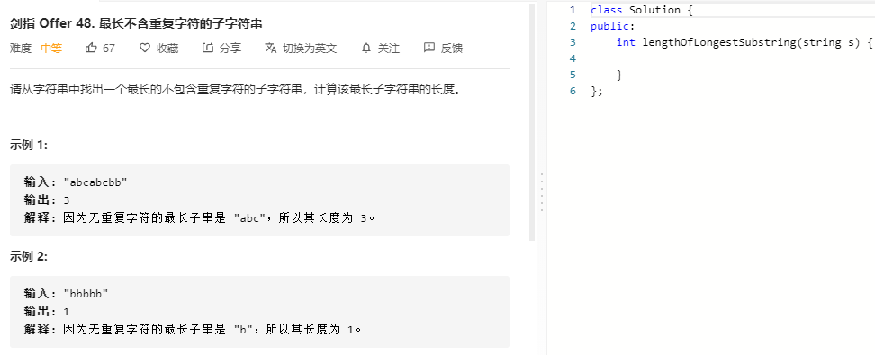

### 题目要求



### 解题思路

参考 [3 无重复字符的最长子串](https://nlper.gitbook.io/leetcode/3) 

### 本题代码

```c++
class Solution {
public:
    int lengthOfLongestSubstring(string s) {
        int start = 0;
        int end = 0;
        int res = 0;
        for(;end < s.size();end++){
            for(int k = start;k < end;k++){
                if(s[k] == s[end]){
                    start = k + 1;
                    break;
                }
            }
            res = max(res, end - start + 1);
        }
        return res;
    }
};
```

### [手撸测试](https://leetcode-cn.com/problems/zui-chang-bu-han-zhong-fu-zi-fu-de-zi-zi-fu-chuan-lcof/)  

