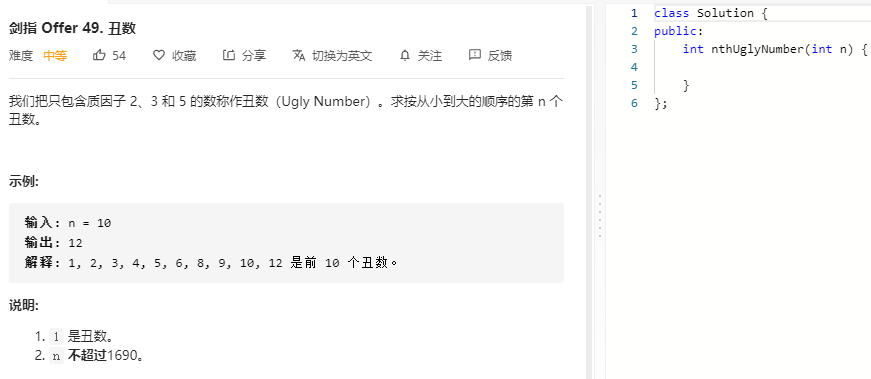

### 题目要求



### 解题思路

和 [204 计算质数](https://nlper.gitbook.io/leetcode/204#jie-ti-si-lu) 放一起训练。基本是网格筛选法，但是该题需要使用动态规划：如果一个数`x`是丑数那么他的2\*x,3*x,5\*x也是丑数，但是需要最小的作为下一个丑数。然后移动各自丑数指针。

### 本题代码

```c++
class Solution {
public:
    int nthUglyNumber(int n) {
        if(n <= 0)
            return 0;
        if(n == 1)
            return 1;
        int p2 = 0, p3 = 0, p5 = 0;
        vector<int>ugly(n,0);
        ugly[0] = 1;
        for(int i = 1;i < n;i++){
            int f2 = 2 * ugly[p2];
            int f3 = 3 * ugly[p3];
            int f5 = 5 * ugly[p5];
            int minf = min(f5, min(f2, f3));
            ugly[i] = minf;
            if(f2 == minf)
                p2++;
            if(f3 == minf)
                p3++;
            if(f5 == minf)
                p5++;
        }
        return ugly[n-1];
    }
};
```

### [手撸测试](https://leetcode-cn.com/problems/chou-shu-lcof/) 

