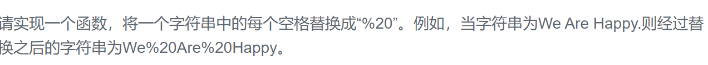

### 题目要求



### 解题思路

从后往前遍历。

### 本题代码

```c++
class Solution {
public:
	void replaceSpace(char *str,int length) {
        if(!str || length < 1)
            return;
        int i = 0;
        int space = 0;
        while(str[i] != '\0'){
            if(str[i] == ' ')
                space++;
            i++;
        }
        int new_length = i + 2 * space;
        if(length < new_length)
            return;
        while(i != -1){
            if(str[i] == ' '){
                str[new_length--] = '0';
                str[new_length--] = '2';
                str[new_length--] = '%';
            }
            else
                str[new_length--] = str[i];
            i--;
        }
	}
};
```

### [手撸测试](https://www.nowcoder.com/practice/4060ac7e3e404ad1a894ef3e17650423?tpId=13&tqId=11155&tPage=1&rp=1&ru=/ta/coding-interviews&qru=/ta/coding-interviews/question-ranking)  

