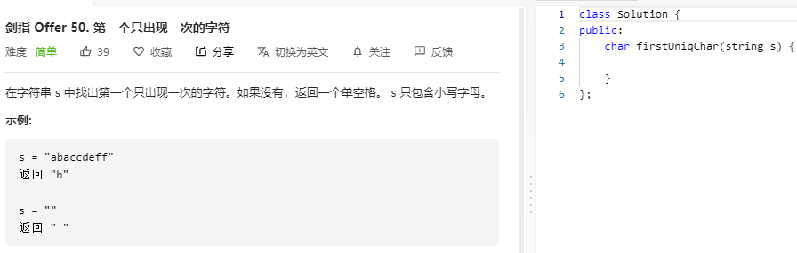

### 题目要求



### 解题思路

哈希。

### 本题代码

```c++
class Solution {
public:
    char firstUniqChar(string s) {
        if(s.size() == 0)
            return ' ';
        unordered_map<char, int>m;
        for(int i = 0;i < s.size();i++){
            m[s[i]]++;
        }
        for(int i = 0;i < s.size();i++)
            if(m[s[i]] == 1)
                return s[i];
        return ' ';
    }
};
```

### [手撸测试](https://leetcode-cn.com/problems/di-yi-ge-zhi-chu-xian-yi-ci-de-zi-fu-lcof/)  

