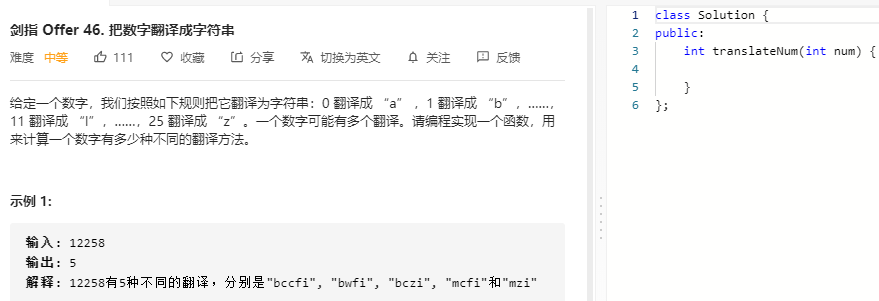

### 题目要求



### 解题思路

直接手撸归并算法。

### 本题代码

```c++
class Solution {
public:
    int cnt = 0;
    int reversePairs(vector<int>& nums) {
        vector<int>temp(nums.size());
        merge(nums, 0, nums.size()-1, temp);
        return cnt;
    }
    void merge(vector<int>& nums, int left, int right, vector<int>& temp){
        if(left >= right)
            return;
        int mid = left + (right - left) / 2;
        merge(nums, left, mid, temp);
        merge(nums, mid+1, right, temp);
        int i = left, j = mid+1, k = left;
        while(i <= mid && j <= right){
            if(nums[j] < nums[i]){
                temp[k++] = nums[j++];
                cnt += (mid-i+1); // 针对于本题  i位置成立那么i之后都成立共有mid-i+1个
            }
            else
                temp[k++] = nums[i++];
        }
        if(i <= mid)
            copy(nums.begin()+i, nums.begin()+mid+1, temp.begin()+k);
        if(j <= right)
            copy(nums.begin()+j, nums.begin()+right+1, temp.begin()+k); //将没有走完的走完
        copy(temp.begin()+left, temp.begin()+right+1, nums.begin()+left);//更新num数组
    }
};
```

### [手撸测试](https://leetcode-cn.com/problems/shu-zu-zhong-de-ni-xu-dui-lcof/)  

