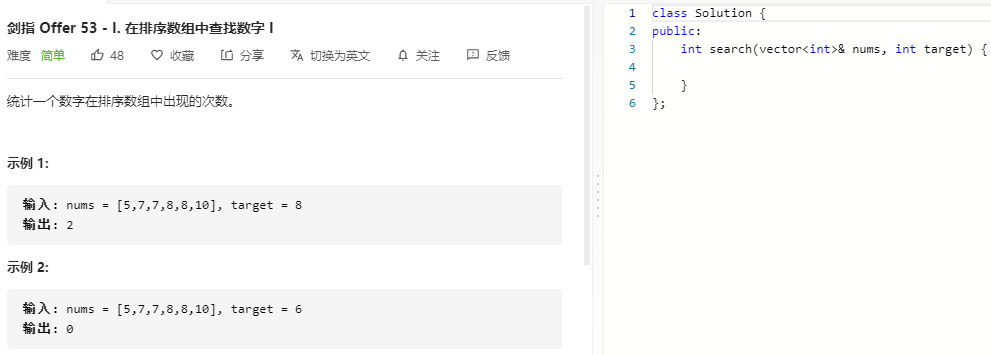

### 题目要求



### 解题思路

利用二分法逼近左右边界.搜素范围是(i, j)两个开区间，因此可以顺利的执行mid+1和mid-1来逼近左右边界。nums[mid] = target时往右走得到右边界right=i，同理nums[mid] = target向左走得到左边界left=j,最终个数是right-left-1。

### 本题代码

```c++
class Solution {
public:
    int search(vector<int>& nums, int target) {
        if(nums.size() == 0)
            return 0;
        int i = 0, j = nums.size() - 1;
        while(i <= j){
            int mid = i + (j - i) / 2;
            if(nums[mid] <= target)
                i = mid + 1; //找到最右的边界
            else
                j = mid - 1;
        }
        int right = i;
        if(j >= 0 && nums[j] != target)
            return 0;
        i = 0, j = nums.size() - 1;
        while(i <= j){
            int mid = i + (j - i) / 2;
            if(nums[mid] < target) //注意区别 本次找到最左的边界
                i = mid + 1;
            else
                j = mid - 1;
        }
        int left = j;
        return right - left -1;
    }
};
```

### [手撸测试](https://leetcode-cn.com/problems/zai-pai-xu-shu-zu-zhong-cha-zhao-shu-zi-lcof/)  

