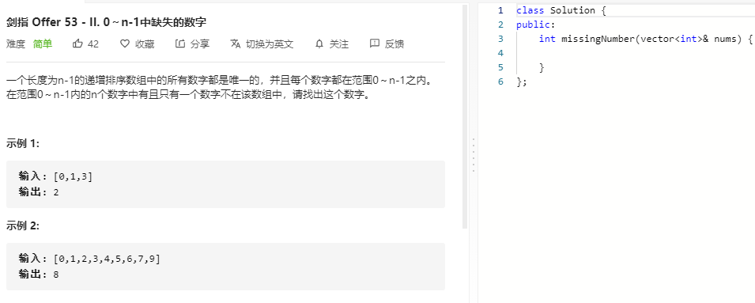

### 题目要求



### 解题思路

两种做法：(1)二分法(因为有排序数组)；(2)利用数组索引信息。二分查找的关键是nums[mid] = mid，如果不满足说明搜索范围是[left, mid-1]，如果满足说明搜索范围是[mid+1, right]。

### 本题代码

#### 解法一 二分法

```c++
class Solution {
public:
    int missingNumber(vector<int>& nums) {
        if(nums.size() == 0)
            return -1;
        int left = 0, right = nums.size()-1;
        while(left <= right){
            int mid = left + (right - left) / 2;
            if(nums[mid] == mid)
                left = mid + 1;
            else
                right = mid - 1;
        }
        return left;
    }
};
```

解法二 利用数组索引信息

```c++
class Solution {
public:
    int missingNumber(vector<int>& nums) {
        if(nums.size() <= 0)
            return -1;
        int res = 0;
        for(int i = 0;i < nums.size();i++){
            res ^= nums[i] ^ i;
        }
        res ^= nums.size();
        return res;
    }
};
```

### [手撸测试](https://leetcode-cn.com/problems/que-shi-de-shu-zi-lcof/)  

