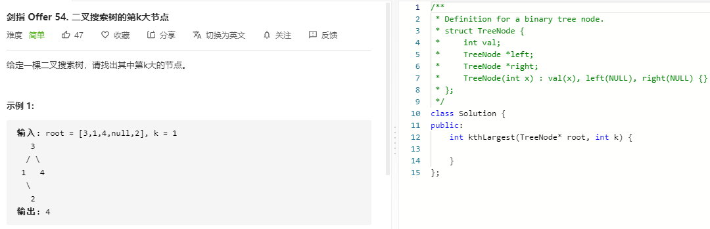

### 题目要求



### 解题思路

二叉树的中序遍历+提前结束。因为找k大的节点并且k从1开始，那么先从right开始中序。

### 本题代码

```c++
class Solution {
public:
    int res = 0;
    int count = 0;
    int kthLargest(TreeNode* root, int k) {
        if(root == NULL)
            return -1;
        // int res = -1;
        count = k;
        inorder(root);
        return res;
    }
    void inorder(TreeNode* root){
        if(root == NULL || count == 0)
            return;
        inorder(root->right);
        if(--count == 0){
            res = root->val;
            return;
        }
        inorder(root->left);
    }
};
```

### [手撸测试](https://leetcode-cn.com/problems/er-cha-sou-suo-shu-de-di-kda-jie-dian-lcof/)  

