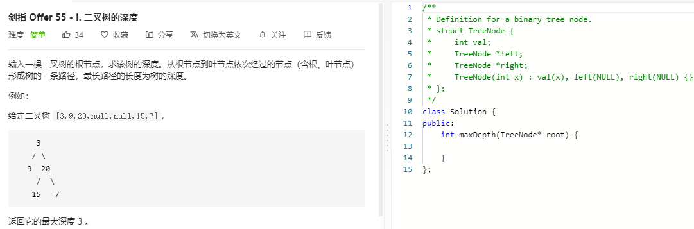

### 题目要求



### 解题思路

直接dfs，先序遍历。

### 本题代码

```c++
class Solution {
public:
    int maxDepth(TreeNode* root) {
        int res = 0;
        dfs(root, 0, res);
        return res;
    }
    int dfs(TreeNode* root, int h, int& res){
        if(root == NULL)
            return h;
        h += 1;
        int left = dfs(root->left, h, res);
        int right = dfs(root->right, h, res);
        res = max(res, max(left, right));
        return max(left, right);
    }
};
```

### [手撸测试](https://leetcode-cn.com/problems/er-cha-shu-de-shen-du-lcof/) 

