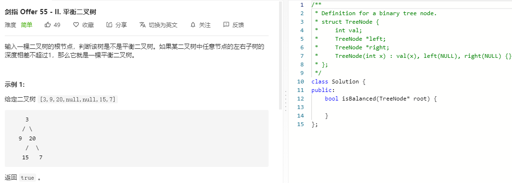

### 题目要求



### 解题思路

直接dfs后续遍历得到树高，然后判断是都是平衡树。

### 本题代码

```c++
class Solution {
public:
    bool isBalanced(TreeNode* root) {
        return help(root) != -1;
    }
    int help(TreeNode* root){
        if(root == NULL)
            return 0;
        int left = help(root->left);
        if(left == -1)
            return -1;
        int right = help(root->right);
        if(right == -1)
            return -1;
        return abs(left-right) < 2 ? max(left, right) + 1 : -1;
    }
};
```

### [手撸测试](https://leetcode-cn.com/problems/ping-heng-er-cha-shu-lcof/)  

