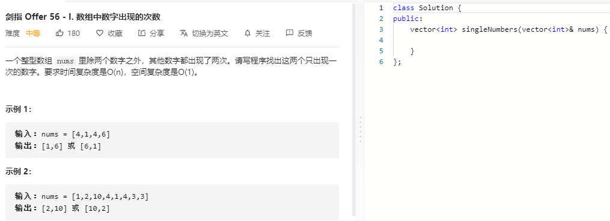

### 题目要求



### 解题思路

直接全部异或，相同的数就会抵消，不同的数的异或结果就会保存。得到两数的异或结果，那么可以找到两数的最低位的1表示两者最低不同位`bit`。重新遍历，相同异或`bit`分一组最终会得到`a`，另一组会得到`b`。

### 本题代码

```c++
class Solution {
public:
    vector<int> singleNumbers(vector<int>& nums) {
        if(nums.size() < 4)
            return vector<int>();
        int res = 0;
        for(auto num: nums)
            res ^= num;
        int bit = res & (~res + 1);
        int a = 0, b = 0;
        for(auto num: nums)
            if(bit & num)
                a ^= num;
            else
                b ^= num;
        return {a,b};
    }
};
```

### [手撸测试](https://leetcode-cn.com/problems/shu-zu-zhong-shu-zi-chu-xian-de-ci-shu-lcof/)  

