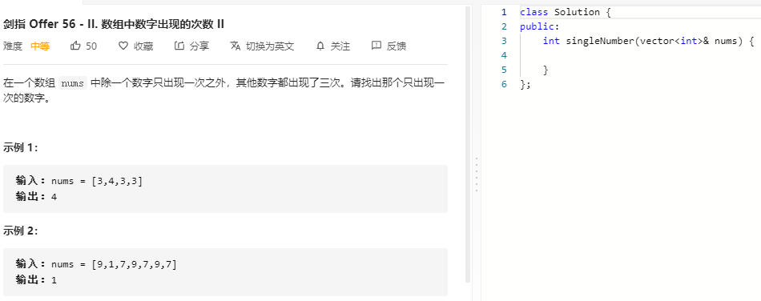

### 题目要求



### 解题思路

同 [137 只出现一次的数字](137.md) .

### 本题代码

```c++
class Solution {
public:
    int singleNumber(vector<int>& nums) {
        if(nums.size() < 4)
            return -1;
        int res = 0;
        for(int i = 0;i < 32;i++){
            int cnt = 0;
            for(auto num: nums){
                cnt += (num >> i) & 1;
            }
            res |= (cnt % 3) << i;
        }
        return res;
    }
};
```

### [手撸测试](https://leetcode-cn.com/problems/shu-zu-zhong-shu-zi-chu-xian-de-ci-shu-ii-lcof/)  

