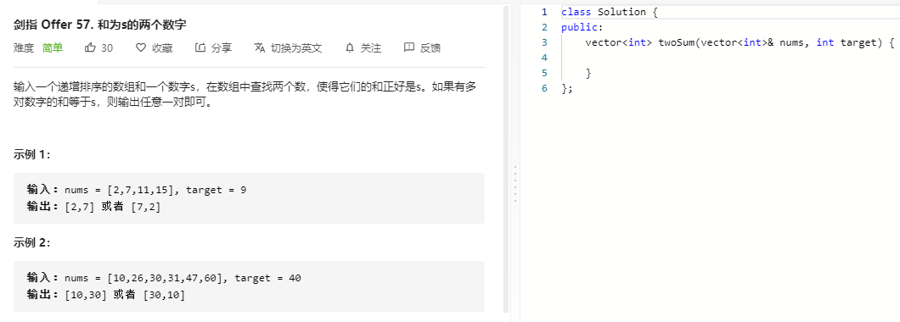

### 题目要求



### 解题思路

两数相加 ....

### 本题代码

```c++
class Solution {
public:
    vector<int> twoSum(vector<int>& nums, int target) {
        int left = 0, right = nums.size() - 1;
        while(left < right){
            if(nums[left] + nums[right] < target){
                left++;
            }
            else if(nums[left] + nums[right] > target){
                right--;
            }
            else
                return {nums[left], nums[right]};
        }
        return {};
    }
};
```

### [手撸测试](https://leetcode-cn.com/problems/he-wei-sde-liang-ge-shu-zi-lcof/)  

