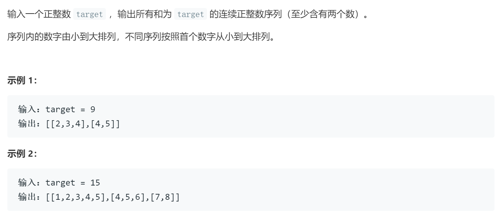

### 题目要求



### 解题思路

双指针解法，保持区间的左闭右开。小于`target`时，左边界动，大于`target`时，右边界动。相等的时候，保存结果，然后右边界移动。

### 本题代码

```c++
class Solution {
public:
    vector<vector<int>> findContinuousSequence(int target) {
        int i = 1; 
        int j = 1; 
        int sum = 0; 
        vector<vector<int>> res;
        while (i <= target / 2) {
            if (sum < target) {
                sum += j;
                j++;
            } 
            else if (sum > target) {
                sum -= i;
                i++;
            } 
            else {
                vector<int>path;
                for (int k = i; k < j; k++) {
                    path.push_back(k);
                }
                res.push_back(path);
                sum -= i;
                i++;
            }
        }
        return res;
    }
};
```

### [手撸测试](https://leetcode-cn.com/problems/he-wei-sde-lian-xu-zheng-shu-xu-lie-lcof/)  

