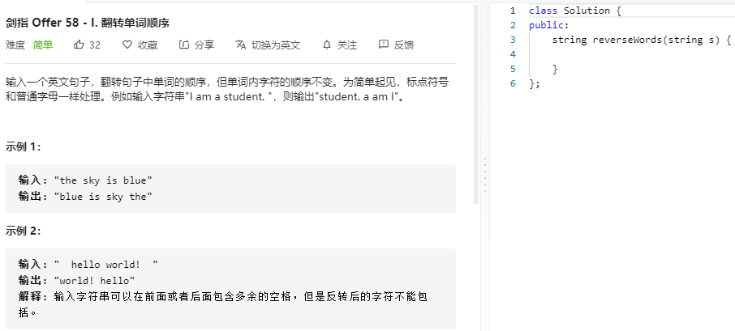

### 题目要求



### 解题思路

思路和 [151 按单词翻转字符串](https://nlper.gitbook.io/leetcode/151) 一样。

### 本题代码

```c++
class Solution {
public:
    string reverseWords(string s) {
        if(s.size() == 0)
            return "";
        string res = "";
        stack<string>sk;
        int i = 0;
        string temp = "";
        while(i < s.size()){
            if(s[i] != ' '){
                temp += s[i];
            }
            else{
                if(temp != ""){
                    sk.push(temp);
                    temp = "";
                }
            }
            i++;
        }
        if(temp != "")
            sk.push(temp);
        int size = sk.size();
        for(int j = 0;j < size-1;j++){
            res += sk.top() + ' ';
            sk.pop();
        }
        if(!sk.empty())
            res += sk.top();
        return res;
    }
};
```

### [手撸测试](https://leetcode-cn.com/problems/fan-zhuan-dan-ci-shun-xu-lcof/)  

