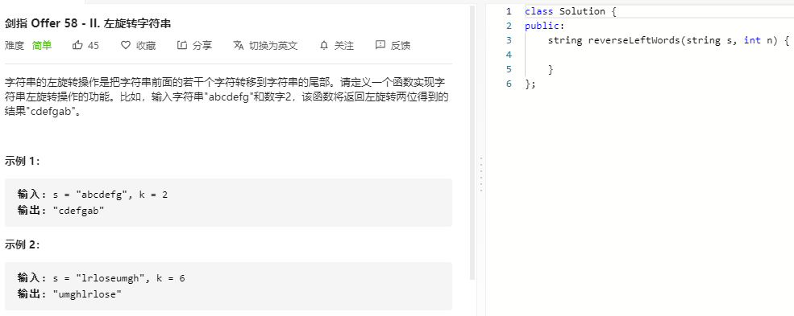

### 题目要求



### 解题思路

三次翻转字符串，先反转（0，n-1）接着翻转(n,size-1)，最后翻转(0, size-1).

### 本题代码

```c++
class Solution {
public:
    string reverseLeftWords(string s, int n) {
        if(s.size() == 0)
            return "";
        n = n % s.size();
        reverse(s, 0, n-1);
        reverse(s, n, s.size()-1);
        reverse(s, 0, s.size()-1);
        return s;
    }
    void reverse(string& s, int start, int end){
        while(start < end){
            char temp = s[start];
            s[start] = s[end];
            s[end] = temp;
            start++;
            end--;
        }
    }
};
```

### [手撸测试](https://leetcode-cn.com/problems/zuo-xuan-zhuan-zi-fu-chuan-lcof/)  

