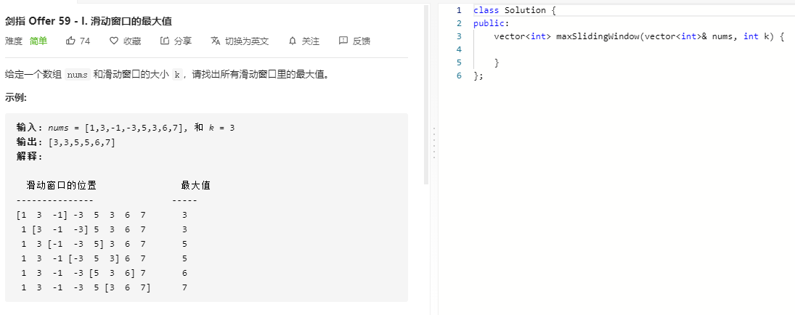

### 题目要求



### 解题思路

详细看 [239 滑动窗口最大值](239.md) 

### 本题代码

```c++
class Solution {
public:
    vector<int> maxSlidingWindow(vector<int>& nums, int k) {
        if(nums.size() == 0 || k > nums.size())
            return vector<int>();
        vector<int>res(nums.size() - k + 1);
        int index = 0;
        deque<int>q;
        for(int i = 0;i < nums.size();i++){
            while(!q.empty() && nums[q.back()] <= nums[i])
                q.pop_back(); // q中保存最大值
            q.push_back(i);
            //处理过期的i
            if(i - q.front() == k)
                q.pop_front();
            //是否满足窗口大小
            if(i - k + 1 >= 0)
                res[index++] = nums[q.front()];
        }
        return res;
    }
};
```

### [手撸测试](https://leetcode-cn.com/problems/hua-dong-chuang-kou-de-zui-da-zhi-lcof/)  

