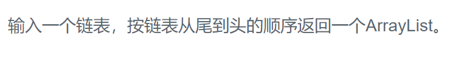

### 题目要求



### 解题思路

要么翻转链表，要么使用栈

### 本题代码

```c++
class Solution {
public:
    vector<int> printListFromTailToHead(ListNode* head) {
        if(head == NULL)
            return vector<int>();
        vector<int>res;
        ListNode* pre = NULL;
        while(head != NULL){
            ListNode* next = head->next;
            head->next = pre;
            pre = head;
            head = next;
        }
        head = pre;
        while(head != NULL){
            res.push_back(head->val);
            head = head->next;
        }
        return res;
    }
};
```

### [手撸测试](https://www.nowcoder.com/practice/d0267f7f55b3412ba93bd35cfa8e8035)  

