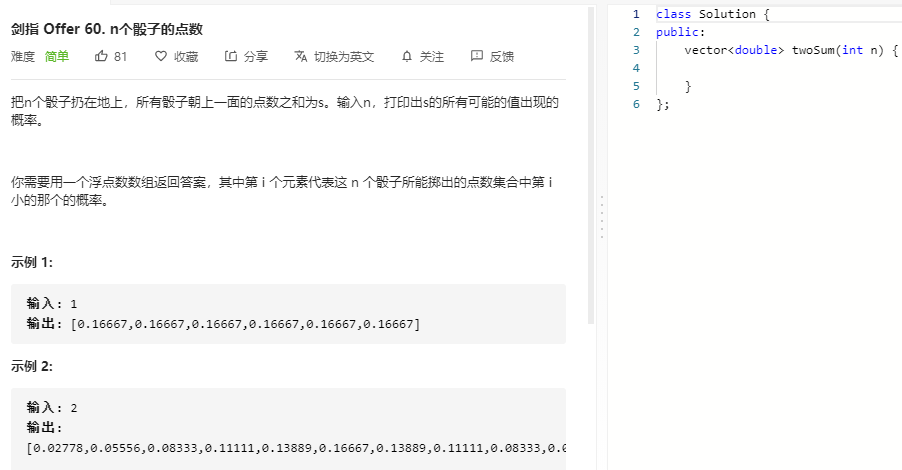

### 题目要求



### 解题思路

动态规划。

明确两点：(1)本题求的是n个筛子点数组合出现的次数/总次数，总次数为 $$6^n$$ ;(2)对于n个骰子，点数组合的范围是(n, 6*n);

确定状态以及转移：`dp[i][j]`表示的是第i个骰子点数和为j的次数，转移方程为：$$dp[i][j] += dp[i-1][j-k]$$ 其中第一个骰子的个点数之和出现的次数都为1，k表示的是用上一个骰子掷出1~6,如果 $$j <= k$$ 就不用计算。j的范围是 [i, 6*i]闭区间。

### 本题代码

```c++
public:
    vector<double> twoSum(int n) {
        if(n <= 0)
            return vector<double>();
        // dp[i][j]表示i个筛子点数之和j出现的次数
        vector<vector<int>>dp(n+1, vector<int>(n*6+1, 0));
        for(int i = 1;i <= n;i++){
            for(int j = i;j <= i*6;j++){
                if(i == 1){
                    // 初始化
                    dp[i][j] = 1;
                    continue;
                }
                for(int k = 1;k <= 6;k++){
                    if(j-k <= 0)
                        break;
                    dp[i][j] += dp[i-1][j-k];
                }
            }
        }
        vector<double>res;
        for(int i = n;i <= 6*n;i++){
            res.push_back(dp[n][i] * pow(1.0/6, n));
        }
        return res;
    }
};
```

### [手撸测试](https://leetcode-cn.com/problems/nge-tou-zi-de-dian-shu-lcof/) 

