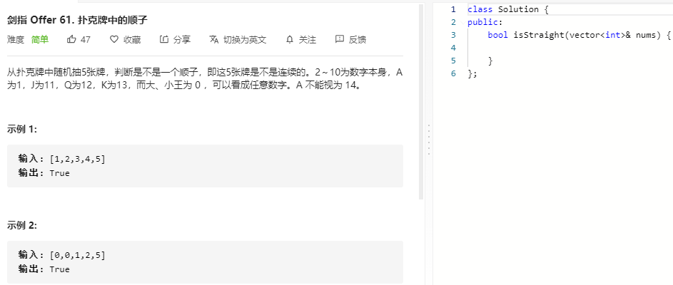

### 题目要求



### 解题思路

将0当作缺失的次数。

### 本题代码

```c++
class Solution {
public:
    bool isStraight(vector<int>& nums) {
        if(nums.size() < 5 || nums.size() > 5)
            return false;
        sort(nums.begin(), nums.end());
        int cnt = 0;
        for(int i = 0;i < nums.size() - 1;i++){
            if(nums[i] == 0)
                cnt++;
            else{
                if(nums[i+1] == nums[i])
                    return false; //出现重复的凉凉
                cnt -= nums[i+1] - nums[i] - 1;
                if(cnt < 0)
                    return false;
            }
        }
        return true;
    }
};
```

### [手撸测试](https://leetcode-cn.com/problems/bu-ke-pai-zhong-de-shun-zi-lcof/)  

