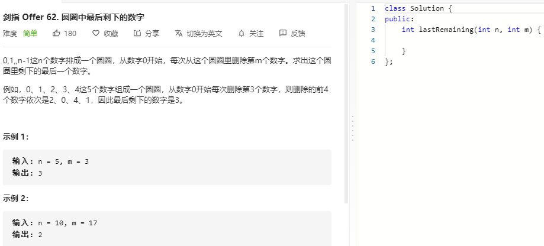

### 题目要求



### 解题思路

使用 $$f(n,m)=y$$ 表示最终的结果是对于n序列从0开始数y+1个数，y表示的是下标。那么 $$f(n-1, m)=x$$ 表示的是对于长度n-1从index=0开始数x+1个数的结果。$$f(n,m)$$ 和 $$f(n-1, m)$$ 之间的关系：


### 本题代码

#### 循环式

```c++
class Solution {
public:
    int lastRemaining(int n, int m) {
        if(m <= 0 || n <= 0)
            return -1;
        int x = 0;
        for(int i = 2;i <= n;i++){
            x = (x + m) % i;
        }
        return x;
    }
};
```

#### 递归式

```c++
class Solution {
public:
    int func(int n, int m){
        if(n == 1)
            return 0;
        int x = func(n-1, m);
        return (x + m) % n;
    }
    int lastRemaining(int n, int m) {
        if(m <= 0 || n <= 0)
            return -1;
        return func(n, m);
    }
};
```

### [手撸测试](https://leetcode-cn.com/problems/yuan-quan-zhong-zui-hou-sheng-xia-de-shu-zi-lcof/)  


