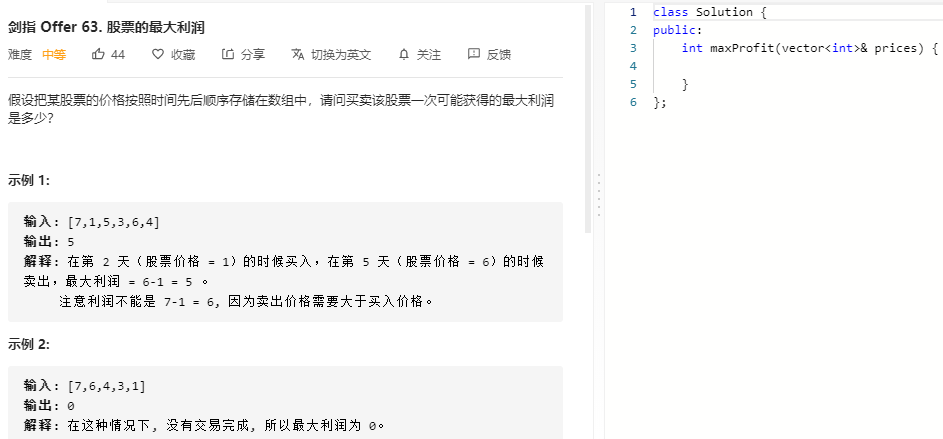

### 题目要求



### 解题思路

最大值减去最小值就是最大利润。一次遍历记录最小值，并更新res。

### 本题代码

```c++
class Solution {
public:
    int maxProfit(vector<int>& prices) {
        if(prices.size() <= 1)
            return 0;
        int res = 0;
        int cost = INT_MAX;
        for(auto price: prices){
            cost = min(cost, price);//每次都是最小值
            res = max(res, price-cost);
        }
        return res;
    }
};
```

### [手撸测试](https://leetcode-cn.com/problems/gu-piao-de-zui-da-li-run-lcof/)  

