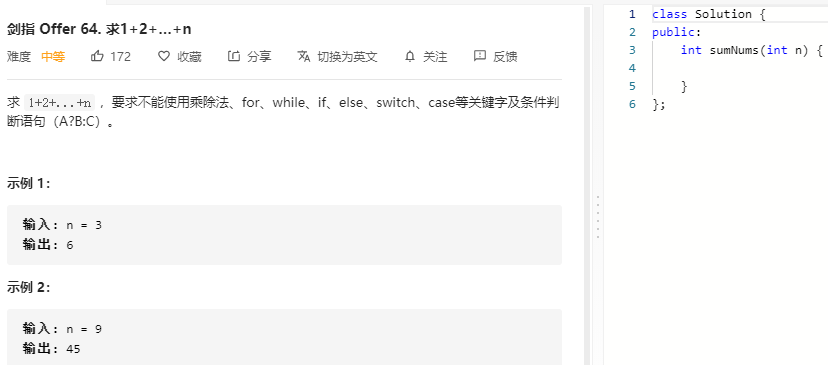

### 题目要求



### 解题思路

使用递归得到累加，出口是当n=0时。

### 本题代码

```c++
class Solution {
public:
    int sumNums(int n) {
        n && (n += sumNums(n-1));
        return n;
    }
};
```

### [手撸测试](https://leetcode-cn.com/problems/qiu-12n-lcof/) 

