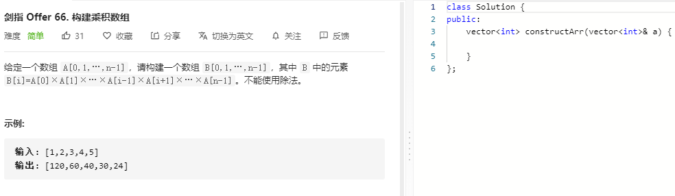

### 题目要求



### 解题思路

双向错位相乘。

### 本题代码

```c++
class Solution {
public:
    vector<int> constructArr(vector<int>& a) {
        if(a.size() <= 0)
            return vector<int>();
        vector<int>res;
        res.push_back(1);
        for(int i = 0;i < a.size()-1;i++){
            res.push_back(res.back() * a[i]);
        }
        int temp = 1;
        for(int i = a.size()-1;i >= 0;i--){
            res[i] *= temp;
            temp *= a[i];
        }
        return res;
    }
};
```

### [手撸测试](https://leetcode-cn.com/problems/gou-jian-cheng-ji-shu-zu-lcof/)  

