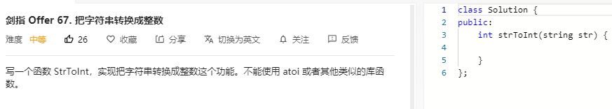

### 题目要求



### 解题思路

正常跳过空格以及确定符号之后，接着转换数字，注意溢出的条件。

### 本题代码

```c++
class Solution {
public:
    int strToInt(string str) {
        if(str.size() == 0)
            return 0;
        int i = 0;
        while(i < str.size() && str[i] == ' ')
            i++;
        int res = 0;
        bool flag = false;
        if(str[i] == '+' || str[i] == '-'){
            flag = str[i] == '-' ? true : false; 
            i++;
        }
        while(i < str.size() && (str[i] >= '0' && str[i] <= '9')){
            int cur = str[i] - '0';
            if(res > INT_MAX / 10 || (res == INT_MAX / 10 && cur >= -(INT_MIN % 10)))
                return flag ? INT_MIN : INT_MAX;
            res = res * 10 + cur;
            i++;
        }
        return flag ? -res : res;
    }
};
```

### [手撸测试](https://leetcode-cn.com/problems/ba-zi-fu-chuan-zhuan-huan-cheng-zheng-shu-lcof/)  

