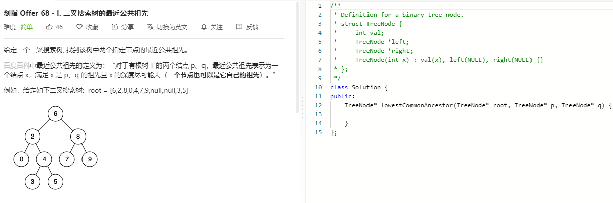

### 题目要求



### 解题思路

二叉树特性直接撸。

### 本题代码

```c++
class Solution {
public:
    TreeNode* lowestCommonAncestor(TreeNode* root, TreeNode* p, TreeNode* q) {
        while(root){
            if(root->val > p->val && root->val > q->val)
                root = root->left;
            else if(root->val < p->val && root->val < q->val)
                root = root->right;
            else
                return root;
        }
        return root;
    }
};
```

### [手撸测试](https://leetcode-cn.com/problems/er-cha-sou-suo-shu-de-zui-jin-gong-gong-zu-xian-lcof/)  

