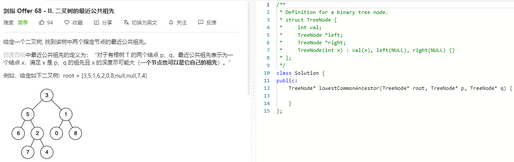

### 题目要求



### 解题思路

递归的解法很简单；循环的解法可以参考：[236 二叉树最近公共祖先](https://nlper.gitbook.io/leetcode/236) 关键点在于构建节点与父结点，找共同路径。

### 本题代码

循环

```c++
class Solution {
public:
    TreeNode* lowestCommonAncestor(TreeNode* root, TreeNode* p, TreeNode* q) {
        if(root == NULL)
            return root;
        unordered_map<TreeNode*, TreeNode*>m;
        queue<TreeNode*>qs;
        qs.push(root);
        while(!qs.empty()){
            if(m[p] != NULL && m[q] != NULL)
                break;
            TreeNode* node = qs.front();
            qs.pop();
            if(node->left){
                qs.push(node->left);
                m[node->left] = node;
            }
            if(node->right){
                qs.push(node->right);
                m[node->right] = node;
            }
        }
        unordered_set<TreeNode*>s;
        while(p){
            s.insert(p);
            p = m[p];
        }
        while(q){
            if(s.find(q) != s.end())
                break;
            q = m[q];
        }
        return q;
    }
};
```

递归

```c++
class Solution {
public:
    TreeNode* lowestCommonAncestor(TreeNode* root, TreeNode* p, TreeNode* q) {
        if(root == NULL || root == p || root == q)
            return root;
        TreeNode* left = lowestCommonAncestor(root->left, p, q);
        TreeNode* right = lowestCommonAncestor(root->right, p, q);
        if(left && right)
            return root;
        return left ? left : right;
    }
};
```

### [手撸测试](https://leetcode-cn.com/problems/er-cha-shu-de-zui-jin-gong-gong-zu-xian-lcof/) 

